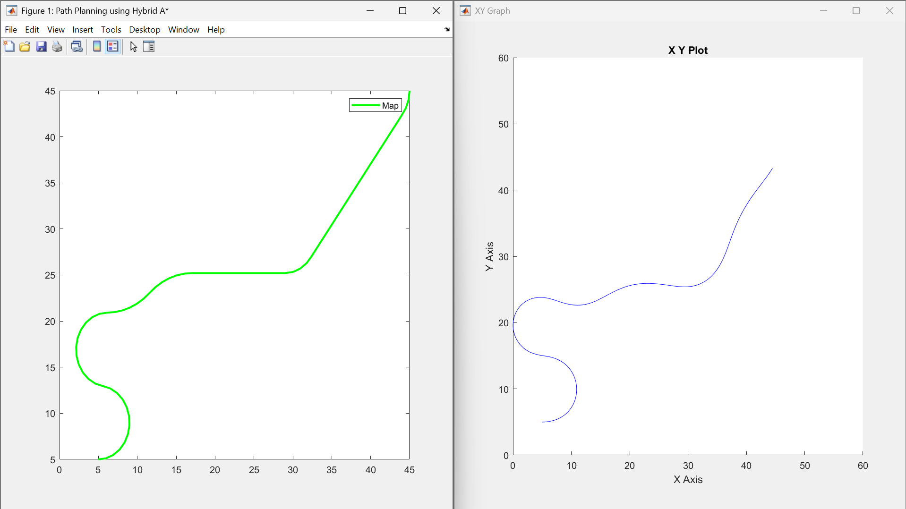
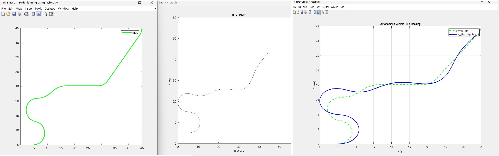

# Autonomous Vehicle Navigation & Path Tracking 🚗🛣️

An advanced mechatronics & control engineering project focused on autonomous trajectory planning, vehicle dynamics modeling, and real-time path tracking using **MATLAB** & **Simulink**.

---

## 📊 Trajectory Simulation & Results

Visual validation of the autonomous navigation algorithms and kinematic controller performance:

### 1. Path Tracking Trajectory

---

### 2. Final Navigation Performance

---

## ⚙️ Key Project Modules

* **Autonomous Path Planning:** Core algorithms engineered in MATLAB (`main_autonomous_navigation.m`) for trajectory generation and reference route calculation.
* **Kinematic Vehicle Dynamics:** Comprehensive Simulink model (`path_tracking_model.slx`) simulating dynamic steering response and vehicle behavior.
* **Closed-Loop Control System:** Real-time path tracking logic minimizing cross-track and heading errors during navigation.

---

## 📁 Repository Files

* `main_autonomous_navigation.m` — Primary MATLAB script for loading trajectory parameters and running navigation loops.
* `path_tracking_model.slx` — Simulink block diagram modeling closed-loop control and vehicle physics.
* `1.png` & `Final_Result_Plot.png` — Simulation output graphs and performance plots.

---

## 💻 Tech Stack & Domain

* **Simulation & Modeling:** MATLAB, Simulink
* **Engineering Domain:** Autonomous Driving, Kinematic Modeling, Control Systems
